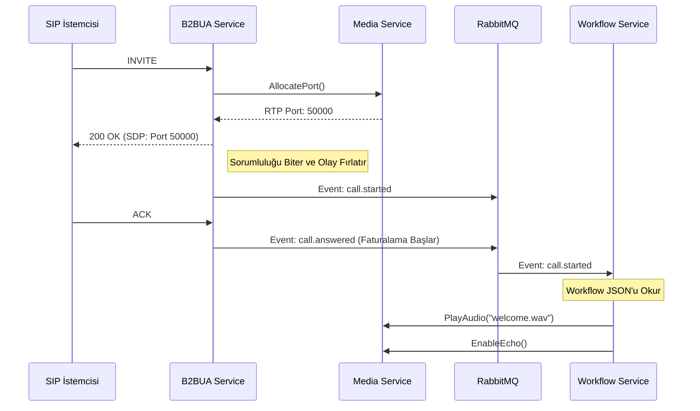

# 🔄 Sentiric B2BUA Service - Mantık Mimarisi (v3.0 - Soft-Defined)

**Rol:** Hat Operatörü ve Olay Üreticisi (Line Operator & Event Producer).
Sistemin SIP sinyalleşmesini yönetir. Yeni mimaride (v3.0+) B2BUA, **hiçbir iş mantığı (business logic) içermez.** "Echo yap", "AI'a bağla", "Ses kaydet" gibi kararlar almaz. 

## 1. Çalışma Prensibi (The Dumb Pipe Philosophy)

B2BUA'nın tek görevi **"Sinyali Kurmak ve Haberdar Etmek"**tir.

### Çağrı Karşılama Akışı (Inbound)

1.  **INVITE Gelir:**
    *   Müşteriye `100 Trying` gönderir.
    *   `media-service`'e gider ve sadece "Bana bir RTP portu ver" (`AllocatePort`) der. 
    *   Medya servisine ne yapacağını ASLA söylemez.
2.  **Cevaplama (200 OK):**
    *   RTP portunu alıp SDP'yi günceller ve müşteriye `200 OK` gönderir.
    *   **[KRİTİK ADIM]:** RabbitMQ'ya `call.started` olayını fırlatır (İçinde RTP Portu, Arayan ve Dialplan bilgisi vardır).
3.  **Kesinleşme (ACK):**
    *   Müşteriden `ACK` geldiğinde, çağrı kesin olarak kurulmuştur.
    *   RabbitMQ'ya `call.answered` olayını fırlatır (Fatura başlangıcı için).
4.  **Kapanış (BYE / CANCEL):**
    *   Çağrı kapandığında `media-service`'teki portu serbest bırakır.
    *   RabbitMQ'ya `call.ended` olayını fırlatır.

## 2. Mimari Devrim: Workflow ile İlişkisi

Eskiden B2BUA, çağrı geldiğinde Media Service'e "Bu bir Echo testi, ses çal" derdi. 
Artık B2BUA sadece `call.started` diye bağırır. **Workflow Service** bu sesi duyar ve Media Service'e "Echo yap" emrini verir. 

Bu sayede B2BUA, oyun motoru, anket botu veya kayıt sistemi gibi yüzlerce farklı projede **tek satır kod değiştirilmeden** kullanılabilir.

## 3. Güvenlik Sınırları
B2BUA, dış dünyadan (SBC üzerinden) gelen IP'leri maskeler. İç ağdaki hiçbir IP dışarı sızmaz.

---
