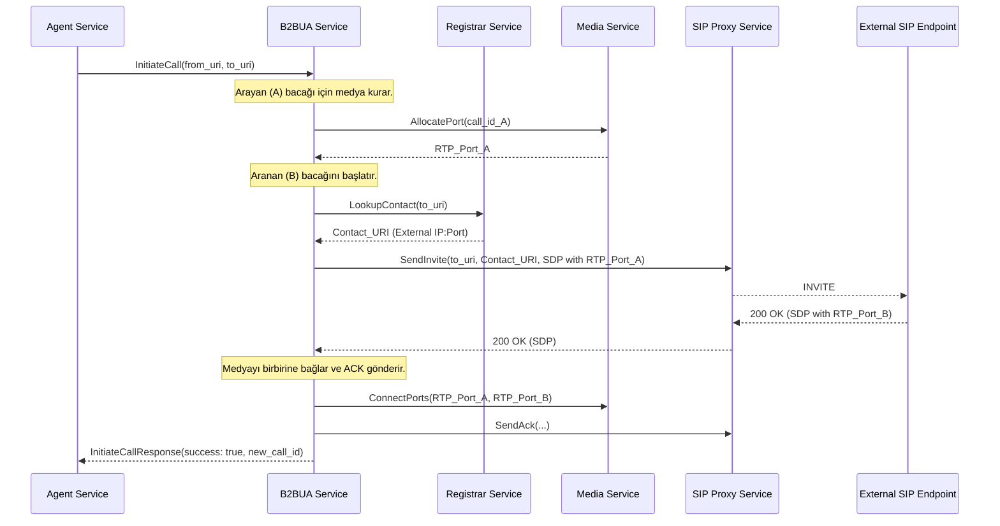

# 🔄 Sentiric B2BUA Service - Mantık ve Akış Mimarisi

**Stratejik Rol:** AI'ın tetiklediği SIP çağrı başlatma ve aktarım işlemlerini yöneten çekirdek aracı.

---

## 1. Dış Çağrı Başlatma (InitiateCall) Akışı

