# 🔄 Sentiric B2BUA Service - Mantık ve Akış Mimarisi

**Stratejik Rol:** AI'ın tetiklediği SIP çağrı başlatma ve aktarım işlemlerini yöneten çekirdek aracı.

---

## 1. Dış Çağrı Başlatma (InitiateCall) Akışı

```mermaid
sequenceDiagram
    participant Agent as Agent Service
    participant B2BUA as B2BUA Service
    participant Registrar as Registrar Service
    participant Media as Media Service
    participant Proxy as SIP Proxy Service
    participant External as External SIP Endpoint

    Agent->>B2BUA: InitiateCall(from_uri, to_uri)
    
    Note over B2BUA: Arayan (A) bacağı için medya kurar.
    B2BUA->>Media: AllocatePort(call_id_A)
    Media-->>B2BUA: RTP_Port_A
    
    Note over B2BUA: Aranan (B) bacağını başlatır.
    B2BUA->>Registrar: LookupContact(to_uri)
    Registrar-->>B2BUA: Contact_URI (External IP:Port)
    
    B2BUA->>Proxy: SendInvite(to_uri, Contact_URI, SDP with RTP_Port_A)
    Proxy-->>External: INVITE
    External-->>Proxy: 200 OK (SDP with RTP_Port_B)
    Proxy-->>B2BUA: 200 OK (SDP)

    Note over B2BUA: Medyayı birbirine bağlar ve ACK gönderir.
    B2BUA->>Media: ConnectPorts(RTP_Port_A, RTP_Port_B)
    B2BUA->>Proxy: SendAck(...)
    
    B2BUA-->>Agent: InitiateCallResponse(success: true, new_call_id)
```

